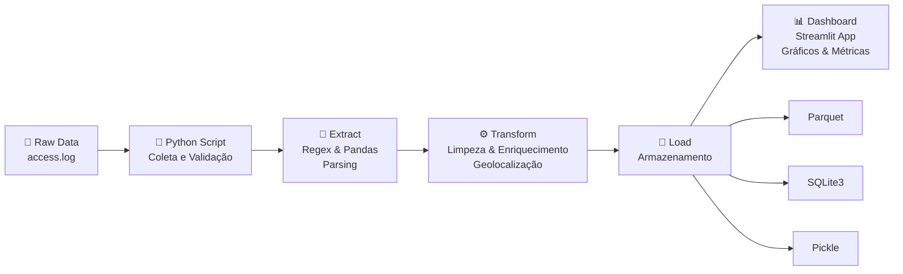

# Análise de Logs de Servidor Web

Um projeto completo de análise e visualização de logs de servidor web, utilizando técnicas de ETL (Extract, Transform, Load) para processar, enriquecer e analisar dados de acesso a servidores.

## Descrição do Projeto

Este projeto implementa um pipeline de dados que coleta logs de acesso HTTP bruto, realiza limpeza e enriquecimento dos dados utilizando geolocalização e análise de user-agents, e disponibiliza as informações através de um dashboard interativo com Streamlit.

**Principais funcionalidades:**
- Extração e parsing de logs de servidor (HTTP)
- Limpeza e validação de dados
- Enriquecimento com geolocalização e informações de navegador
- Armazenamento em múltiplos formatos (Parquet, SQLite, Pickle)
- Dashboard interativo com métricas e visualizações em Plotly
- Análise exploratória com Jupyter Notebooks

---

## 📁 Estrutura do Projeto

```
Analise de logs de servidor web/
├── accessLog.csv              # Logs brutos de acesso HTTP
├── Ips.csv                    # Dados enriquecidos de geolocalização de IPs
├── access.log                 # Arquivo de log original do servidor
├── log_dw.pkl                 # Dataset processado (pickle format)
├── logServidores_web.db       # Banco de dados SQLite com dados processados
├── Análise.ipynb              # Notebook com análise exploratória de dados
├── index.ipynb                # Notebook adicional para análises
├── dashboard.py               # Dashboard interativo com Streamlit
├── workflow.excalidraw        # Diagrama visual do pipeline de dados
├── requirements.txt           # Dependências Python
└── README.md                  # Este arquivo
```

---

## 🔄 Workflow do Projeto



### Etapas do Pipeline:

1. **Extract** 
   - Leitura de logs brutos em formato HTTP
   - Parsing com expressões regulares
   - Validação de campos

2. **Transform** 
   - Limpeza e normalização de dados
   - Identificação de user-agents (navegadores, bots)
   - Detecção de dispositivos (mobile, tablet, PC)
   - Enriquecimento com geolocalização de IPs
   - Cálculo de status codes e taxa de erros

3. **Load** 
   - Armazenamento em Parquet (formato colunar)
   - Persistência em SQLite3 para consultas SQL
   - Exportação em Pickle para análises rápidas

4. **Visualização** 
   - Dashboard interativo com Streamlit
   - Gráficos interativos com Plotly
   - Filtros por período, IP, URL e status

---

## 📊 Dados Disponíveis

### Arquivos de Dados

| Arquivo | Descrição | Registros |
|---------|-----------|-----------|
| `accessLog.csv` | Logs completos com análise de user-agents | ~100k+ registros |
| `Ips.csv` | Geolocalização e informações de rede de IPs | Dados enriquecidos |
| `log_dw.pkl` | Dataset processado em formato Pickle | Dados limpos |

### Dados Extraídos

**Do arquivo de log cada requisição contém:**
- IP do cliente
- Data e hora
- Método HTTP (GET, POST, etc.)
- URL acessada
- Protocolo (HTTP/1.1, HTTP/2, etc.)
- Status HTTP
- Device type (mobile, tablet, PC)
- Bot detection
- Navegador e SO
- Geolocalização (país, cidade, coordenadas)
- ISP e provedor de rede

### KPIs Principais

- **Total de requisições:** Contagem geral de acessos
- **IPs únicos:** Número de clientes distintos
- **Taxa de erros (4xx/5xx):** Percentual de requisições com problemas
- **URL mais visitada:** Endpoint mais acessado
- **Distribuição de status codes:** Análise de sucesso vs erros
- **Requisições por horário:** Padrão de acesso ao longo do dia
- **Requisições por país:** Distribuição geográfica
- **Proporção de bots:** Percentual de acesso automatizado

---

## 🛠️ Tecnologias e Dependências

### Stack Tecnológico

| Tecnologia | Versão | Propósito |
|-----------|--------|----------|
| **Python** | 3.x | Linguagem principal |
| **Pandas** | 3.0.1 | Manipulação de dados |
| **NumPy** | 2.4.2 | Computações numéricas |
| **Plotly** | 6.5.2 | Visualizações interativas |
| **Streamlit** | - | Framework para dashboard |
| **SQLAlchemy** | 2.0.46 | ORM para banco de dados |
| **Jupyter** | 9.10.0 | Notebooks interativos |
| **user-agents** | 2.2.0 | Parsing de user-agents |
| **ua-parser** | 1.0.1 | Parser de navegadores e SO |

**Todas as dependências podem ser instaladas com:**

```bash
pip install -r requirements.txt
```

---

## 🚀 Como Usar

### 1. Instalação

```bash
# Clonar o repositório
git clone <repositorio>
cd "Analise de logs de servidor web"

# Instalar dependências
pip install -r requirements.txt
```

### 2. Análise Exploratória (Jupyter)

Para analisar os dados interativamente:

```bash
jupyter notebook Análise.ipynb
```

O notebook `Análise.ipynb` contém:
- Carregamento e exploração dos dados
- KPIs principais
- Visualizações com Plotly
- Análise de tendências por horário
- Distribuição geográfica
- Segmentação de URLs
- Detecção de padrões de acesso

### 3. Dashboard Interativo (Streamlit)

Para visualizar o dashboard em tempo real:

```bash
streamlit run dashboard.py
```

O dashboard oferece:
- Visualizações interativas
- Filtros dinâmicos
- Gráficos de tendências
- Mapa geográfico
- Análise de dispositivos
- Estatísticas de bots

---

## 📈 Características da Análise

### Visualizações Incluídas

1. **Distribuição de Status Codes**
   - Gráfico de pizza com sucesso vs erros
   - Análise detalhada de 4xx e 5xx

2. **Requisições por Horário**
   - Linha do tempo mostrando picos de acesso
   - Identificação de períodos de maior atividade

3. **Top URLs Acessadas**
   - Ranking dos endpoints mais visitados
   - Volume de requisições por URL

4. **Distribuição Geográfica**
   - Mapa dos países de origem
   - Tabela com IPs únicos por localização

5. **Análise de Dispositivos**
   - Proporção de mobile, tablet e desktop
   - Tendências de acesso por tipo de dispositivo

6. **Atividade de Bots**
   - Percentual de acesso de bots vs usuários reais
   - Identificação de bots mais comuns

7. **Análise de Navegadores**
   - Navegadores mais utilizados
   - Sistemas operacionais

---

## 📝 Estrutura dos Notebooks

### `Análise.ipynb`
Notebook principal com análise completa dos dados:
- **Seção 1:** Carregamento e informações dos dados
- **Seção 2:** KPIs principais (total de requisições, IPs únicos, taxa de erros)
- **Seção 3:** Análise temporal (padrões por hora)
- **Seção 4:** Geolocalização e origem dos acessos
- **Seção 5:** Análise de URLs e endpoints
- **Seção 6:** Segmentação por dispositivo
- **Seção 7:** Detecção e análise de bots

### `index.ipynb`
Notebook adicional com análises complementares e experimentações.

---

## 💡 Insights Possíveis

Com esta análise você pode:

- Identificar padrões de acesso ao servidor
- Descobrir origem geográfica do tráfego
- Detectar atividade de bots e crawlers
- Entender quais dispositivos mais acessam o site
- Otimizar infraestrutura baseado em horários de pico
- Identificar tentativas de acesso indevido (4xx/5xx)
- Gerar relatórios executivos de tráfego
- Comparar performance entre URLs

---

## 📦 Formatos de Armazenamento

O projeto utiliza múltiplos formatos para diferentes necessidades:

### Pickle (`.pkl`)
- **Uso:** Carregamento rápido para análises em Jupyter
- **Vantagem:** Preserva tipos de dados Python, carregamento instantâneo
- **Arquivo:** `log_dw.pkl`

### SQLite (`.db`)
- **Uso:** Consultas SQL, relatórios dinâmicos
- **Vantagem:** Portabilidade, suporta queries complexas
- **Arquivo:** `logServidores_web.db`

### Parquet
- **Uso:** Armazenamento comprimido, analytics
- **Vantagem:** Compressão, leitura coluna-por-coluna eficiente
- **Ideal para:** Big data e análises estatísticas

---

## 🔧 Customizações Possíveis

Você pode adaptar o projeto para:

- Adicionar novos filtros no dashboard
- Incluir análise de performance (response time)
- Integrar alertas para anomalias
- Expandir análise de segurança
- Gerar relatórios automáticos
- Adicionar machine learning para previsões
- Integrar com ferramentas de monitoramento

---

## 📋 Requisitos do Sistema

- **Python:** 3.8+
- **Memória RAM:** 2GB (mínimo para análise completa)
- **Espaço em disco:** 500MB para dados + dependências
- **Navegador:** Qualquer navegador moderno para o dashboard

---

## 📧 Informações Adicionais

Este projeto foi desenvolvido como parte de um estágio, com foco em:
- Engenharia de dados (ETL pipeline)
- Análise exploratória de dados (EDA)
- Visualização de dados
- Desenvolvimento de dashboards

---

## 📄 Archivos Especiais

- **`workflow.excalidraw`:** Diagrama visual do pipeline (abrir com Excalidraw)
- **`tabela operadores re.pdf`:** Referência de expressões regulares usadas na parsing

---

## Status do Projeto

- Pipeline ETL completo
- Dashboard funcional
- Análise exploratória
- Documentação
- Possíveis melhorias e expansões

---

**Desenvolvido durante estágio**

*Última atualização: Fevereiro de 2026*
